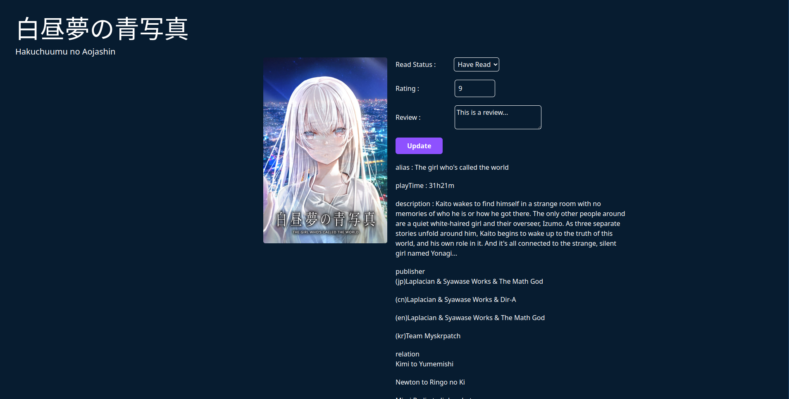

# personal-vn-list

# Links

- [live-preview](https://azanra.github.io/personal-vn-list/)

# About

This project focus on creating a react component that is interactable
by the user. The user can decide whether the vn have been read or not,
decide the rating, and leave a review for it.

# Review

My first react project that is interactable by the user. So because
of how react works, it's really different on how it usually done with
vanilla html, css, and js. First of all there is three phases of react,
first is triggering a render, rerender, and commit. triggering in render
done by changing the state, So whenever state changed, it will trigger a
rerender. and after that react will commit or make the changes to the dom.

Normal variable can't persist to the next render, that's why we need to use state
to save it, becoming a memory for the component which will be saved outside of the
component and will be saved to react instead. and changing the state, by default
the value only will be changed for the next state instead of current state. Those
are what useState are used for or called hooks, which is a built in function
by react.

# Screenshot

